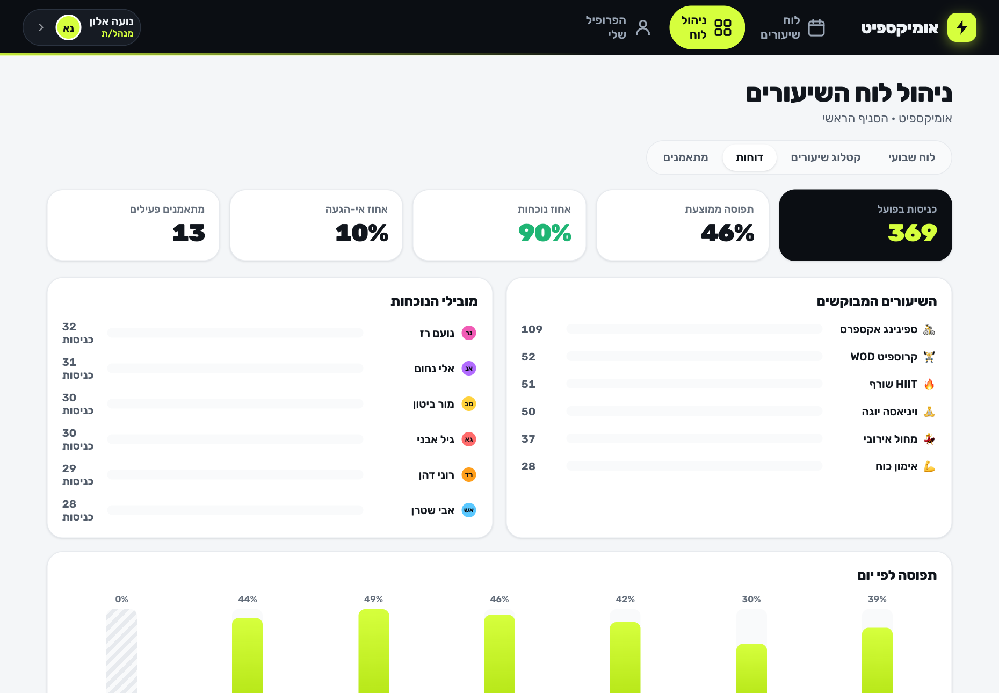
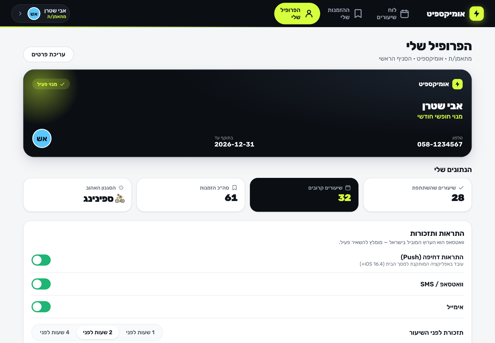

# אומיקספיט · Omixfit

A sporty, Hebrew‑first **RTL PWA** for booking fitness classes — built from
[`docs/plan.md`](docs/plan.md). Trainees browse the week and book a spot in one
tap; trainers/managers publish and manage the schedule.

> **Stack:** Vite + React + TypeScript, hand‑crafted CSS design system, zero
> runtime UI dependencies. State persists to `localStorage` (a real backend
> swaps in behind the same store API).

## Screenshots

| Trainee — weekly schedule | One‑tap booking |
| --- | --- |
|  |  |

| Trainer — schedule grid | Trainer — reports |
| --- | --- |
|  |  |

<p align="center"></p>

## Deploy — Firebase Hosting

The site is hosted on **Firebase Hosting** (config in [`firebase.json`](firebase.json) /
[`.firebaserc`](.firebaserc)). One-time: `npx firebase-tools login`. Then every deploy is:

```bash
npm run deploy     # = npm run build && firebase deploy --only hosting
```

The build embeds the Firebase config from `.env.local`, so there are no separate
deploy secrets — the web config isn't sensitive (it ships in the client bundle by
design). Firebase Hosting serves from the domain root, and its `*.web.app` /
`*.firebaseapp.com` domains are automatically trusted by Firebase Auth, so there's
no authorized-domain step. The app is also base‑path aware (`VITE_BASE`) if you ever
serve it from a subpath instead.

## Run it

```bash
npm install
npm run dev        # http://localhost:5173
npm run build      # type-check + production build
npm run preview    # serve the production build on :4173
npm test           # runtime smoke test of the booking engine (18 checks)
npm run icons      # regenerate PWA icons
npm run shots      # visual QA — screenshot every screen via headless Chrome
npm run a11y       # automated WCAG 2.1 AA audit (axe-core) — 0 violations, 9 surfaces
npm run focus      # keyboard test: modal focus trap + restore (5 checks)
npm run e2e        # end-to-end UI test: book → My Bookings → cancel (7 checks)
```

> **Visual QA:** `scripts/shots.mjs` drives system Chrome (via `puppeteer-core`,
> no bundled Chromium) against the preview server and writes `screenshots/*.png`
> for every screen at desktop + mobile widths. Run `npm run preview` first.

### Firebase Authentication (email + password)

Login is real [Firebase Auth](https://firebase.google.com/docs/auth). To run it:

1. In the [Firebase console](https://console.firebase.google.com/), enable
   **Build → Authentication → Sign-in method → Email/Password**.
2. Copy `.env.example` → `.env.local` and fill in your web app config
   (*Project settings → General → Your apps → SDK setup & config*).

The app shows a **sign-in / sign-up** screen. Signing up with an unknown email
auto-creates a **member** (inactive membership — a manager activates it).
Seeded staff carry demo emails (`<id>@omixfit.app`), so signing up as
`noa@omixfit.app` logs you in as **נועה, the manager**, `yael@omixfit.app` as an
instructor, etc. — that's how you reach the management side. Sign out from the
account sheet (top app-bar avatar).

**For the browser QA scripts** (`a11y`/`e2e`/`shots`/…): they sign in through
Firebase, so the preview build must embed your config (`.env.local` set, then
`npm run build`) and the demo accounts must exist in the project. Create
`noa@`, `yael@`, `dana@`, `avi@omixfit.app` with the shared password
`Omixfit-demo-1` (or set `OMIXFIT_TEST_PASSWORD`).

> **Where the data lives.** Both auth (accounts) **and** all domain data —
> bookings, schedule, classes, profiles, roles/membership — live in **Firebase
> (Auth + Cloud Firestore)**. Data streams in live, so changes sync across devices
> in real time, and booking capacity is enforced with an atomic Firestore
> transaction. Firestore's persistent cache keeps the app working offline. The DB
> seeds itself on first run. Security rules require sign-in for all reads/writes;
> roles are UI-gated (un-forgeable role security needs the Blaze plan + custom
> claims — a documented future upgrade).

## What works today

**Trainee**
- Weekly calendar, RTL, **week starts Sunday**, Hebrew dates; navigate weeks.
- Day strip with per‑day class counts; Shabbat marked as reduced activity.
- Class cards: time, instructor, room, live **spots‑remaining** bar, category color.
- Category filters; tap a card → detail sheet with description + book/cancel.
- **Waitlist** (§4.3 / Q4): when full, join the waitlist and see your position;
  on a cancellation the first in line is **auto‑promoted** to confirmed.
- **My Bookings** (upcoming / past) with empty‑state onboarding.

**Trainer / Manager**
- Week grid (7 columns) with fill counts; KPI tiles (sessions, booked, fill‑rate).
- Create a session (type, date, time, duration, capacity, instructor, room).
- **Recurrence**: generate 1 / 4 / 8 weekly occurrences in one action.
- Edit / cancel / delete a session; cancelling notifies (toast stand‑in).
- **Roster** with names + phones and **attendance / no‑show** marking.
- **Class‑type catalog** (טמפלייטים) — create/edit/delete class types, with a
  delete‑guard while sessions still reference a type.
- **Reports dashboard** (plan.md §4.6) — utilization, attendance vs. no‑show
  rate, most‑popular classes, attendance‑by‑weekday (Shabbat shown closed),
  and a member attendance leaderboard.
- **Member management** (§4.6 / §4.1) — searchable member list; per‑member sheet
  with role assignment, membership activation toggle, stats, recent activity.
- **Audit log** (§4.6) — every manager action (create/edit/cancel/delete session
  or type, role/membership change) is recorded with actor + relative time, shown
  as a timeline in the Reports tab.

**Profile (everyone)**
- Membership card (plan, status, validity), personal stats (attended / upcoming
  / favorite style), editable name + phone, notification preferences
  (push / WhatsApp / email + reminder lead time).
- Booking success fires a confetti **celebration** micro‑interaction.

**Platform**
- Installable PWA (manifest, service worker offline shell, generated icons).
- iOS / Android install guidance banner.
- Atomic capacity enforcement, booking window, cancellation cutoff, anti‑hoarding
  limit, membership gating — all verified by `npm test` (12 checks).

## Architecture

```
src/
  lib/        types · date (Sunday-start, Hebrew) · i18n · seed · store (booking engine)
  components/ ClassCard · SessionDetail · SessionEditor · UserSwitcher · Sheet · Toast · icons
  screens/    Schedule (trainee) · MyBookings · Manage (trainer)
  styles/     theme.css (tokens + primitives) · app.css (layout + screens)
public/       manifest · sw.js · icons
```

Product decisions (Q1–Q8 from the plan) are baked in: instructor is a real role;
booker names are **staff‑only** (privacy); booking is gated on `membershipActive`;
`locationId` lives on every session; the `Booking` state enum already includes
`waitlisted`/`no_show` for v2.

## Iteration status (Ralph loop)

- [x] **i1** — Scaffold, design system, data layer + booking engine, both
      experiences, PWA. Smoke test (12 checks).
- [x] **i2** — Member profile + membership card, notification preferences,
      class‑type catalog manager, booking celebration. Smoke test now 17 checks.
- [x] **i3** — Headless‑Chrome visual QA harness (real screenshots); fixed
      persist‑on‑load; richer seed (18 members, resolved past attendance);
      manager Reports dashboard. Smoke test now 18 checks.
- [x] **i4** — Member management (search, role assignment, membership toggle);
      accessibility pass to **WCAG 2.1 AA, 0 axe violations** (contrast, skip
      link, focus rings, aria‑current/live, fixed a nested‑interactive card).
- [x] **i5** — Audit log (§4.6: who changed/cancelled what) with live logging on
      every manager mutation + seeded history; keyboard arrow‑nav across the
      calendar day strip. Smoke test now 20 checks.
- [x] **i6** — Waitlist (§4.3 / Q4): join when full, FIFO position, auto‑promote
      on cancellation or capacity increase, staff waitlist roster, My‑Bookings
      badge. Smoke test now 28 checks; axe still 0 violations.
- [x] **i7** — Live clock tick (§5.3): the schedule + My Bookings refresh
      time‑dependent state (booking window closing, sessions rolling into the
      past) without a user interaction.
- [x] **i8** — Error boundary (§5.6 graceful degradation): a runtime render
      error shows an on‑brand Hebrew fallback with reload + reset‑data recovery,
      instead of a blank page.
- [x] **i9** — Extended the axe audit to the **modal/sheet states** (9 surfaces,
      not 4); found & fixed 6 real violations: unlabeled form controls (session /
      profile / type editors), low‑contrast attendance toggles, and avatar
      initials — now auto‑pick dark/white for AA on any palette color.
- [x] **i10** — Verified the console is clean across all screens/modals, then
      fixed a real **modal focus** defect axe can't see: the `Sheet` now moves
      focus in on open, **traps Tab**, and restores focus to the trigger on
      close (WCAG 2.4.3). New `npm run focus` keyboard test (5 checks).
- [x] **i11** — Audited CSS/JSX for RTL physical‑direction leaks (none — all
      logical); added an **end‑to‑end UI test** (`npm run e2e`) driving the real
      booking journey (book → My Bookings → cancel) through Chrome (7 checks).
- [x] **i12** — Viewport stress test (`npm run responsive`, 320/768/1920) caught
      real **horizontal overflow at 320px** → fixed the install banner (CTA wraps),
      the manager tab bar (scrolls), the day strip (shrinkable columns), and the
      app bar (avatar‑only switcher on narrow). Made the browser tests
      date‑robust (Shabbat/empty‑day safe).
- [x] **i13** — Edge‑case content stress: injected worst‑case long Hebrew names
      across cards, grid cells, member rows and the modal — all wrap/grow with no
      overflow or truncation loss. Added `npm run stress` as a durable
      no‑overflow‑under‑long‑content guard (8 checks, mobile + desktop).
- [x] **i14** — Empty‑state probe (`npm run empty`): no NaN/undefined leaks
      anywhere, but found 2 real UX gaps — the empty **catalog** rendered blank
      and the empty **Reports** chart sections had no message. Both now show
      proper on‑brand empty states with a CTA.
- [x] **i15** — Lighthouse audit (`npm run lighthouse`, mobile) found & fixed
      real issues: **heading‑order** skips, day‑strip buttons failing **label‑in‑
      name** (WCAG 2.5.3), and an invalid **robots.txt**. Result:
      **Perf 94 · A11y 100 · Best Practices 100 · SEO 100**.
- [x] **i16** — Verified the **PWA offline shell** (§5.2) actually works:
      `npm run offline` loads the app, warms the service‑worker cache, goes
      offline, and confirms the shell renders, state hydrates from localStorage,
      and client‑side nav still works (4 checks).
- [x] **i17** — Made the app **deployable as a live site**: base‑path‑aware build
      (assets / service worker / manifest / icons resolve relative to the deploy
      base), plus a GitHub Pages Actions workflow. Verified at both `/` (root,
      all tests green) and `/Omixfit/` (subpath, renders + SW active, 0 failed
      requests).
- [x] **i18** — Professional repo presentation: curated showcase screenshots
      (`npm run showcase`) committed to `docs/media/` and embedded in this README
      so the project shows the real UI at a glance.
- [x] **i19** — Self‑hosted the Rubik font (`npm run fonts`): one variable woff2
      per subset (Hebrew + Latin), bundled by Vite. Removes the render‑blocking
      third‑party request and the Google dependency, and makes the brand font
      render **offline**. **Performance 94 → 99** (A11y/BP/SEO still 100).

- [x] **i20** — Real **Firebase Authentication** (email + password, plan.md §4.1):
      replaced the demo user-picker login with sign-in/sign-up, mapped to app users
      **by email** (auto-creating an inactive member for new emails). The firebase
      SDK is **code-split** and rendering is **optimistic** (paints from persisted
      state, reconciles auth in the background) so first paint never waits on it —
      **Performance 98 · A11y 100 · BP 100 · SEO 100**. Auth verified end-to-end
      against a live project; the browser QA scripts now sign in through Firebase.

- [x] **i21** — **Cloud Firestore** backend: all domain data (bookings, schedule,
      classes, users, audit) moved out of `localStorage` into Firestore, streamed
      live via `onSnapshot` so the app **syncs across devices in real time**.
      Capacity is now a genuine cross-client **atomic transaction** (denormalized
      per-session counter), with FIFO waitlist promotion re-checked transactionally.
      Pure booking engine extracted to `src/lib/engine.ts` (keeps `npm test` a fast
      node gate); the DB self-seeds on first run; persistent cache keeps it working
      offline. Verified against a live project (seed, sign-in, atomic booking,
      real-time two-device sync, a11y 0 violations, offline). Rules require sign-in
      (roles UI-gated; Blaze + custom claims is the upgrade for un-forgeable roles).
      Lighthouse: **Perf 85 · A11y 100 · BP 100 · SEO 100** (the real-time SDK adds
      first-paint weight — the cost of a live cloud backend).

**MVP + v1 coverage of `docs/plan.md` is complete.** Deferred to a true v2 (per
the §6 decisions): a payments/billing engine, no‑show penalty strikes,
multi‑branch UI, and real‑time multi‑client spot‑counts via WebSocket/SSE (the
client now self‑refreshes on a timer; cross‑client push needs a backend) — all
have data‑model hooks already in place (`membershipActive`, `no_show`,
`locationId`).
